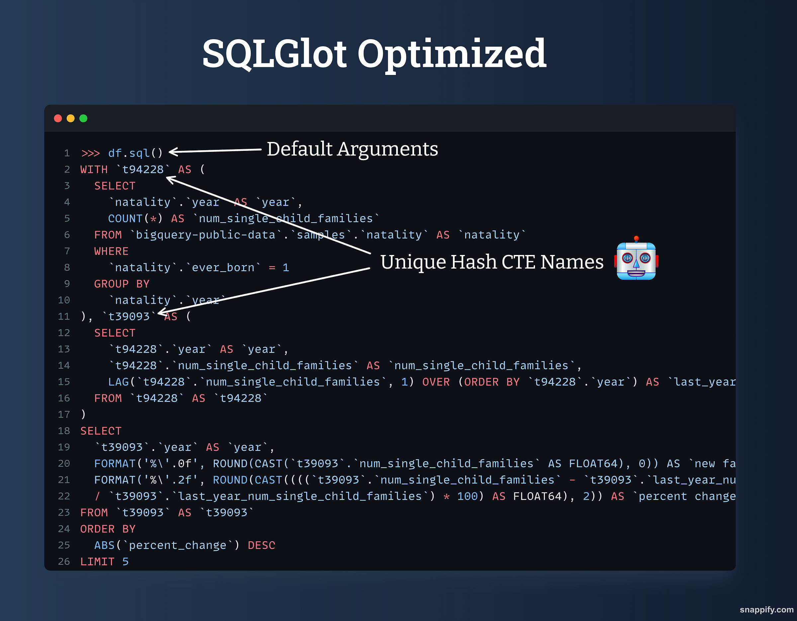
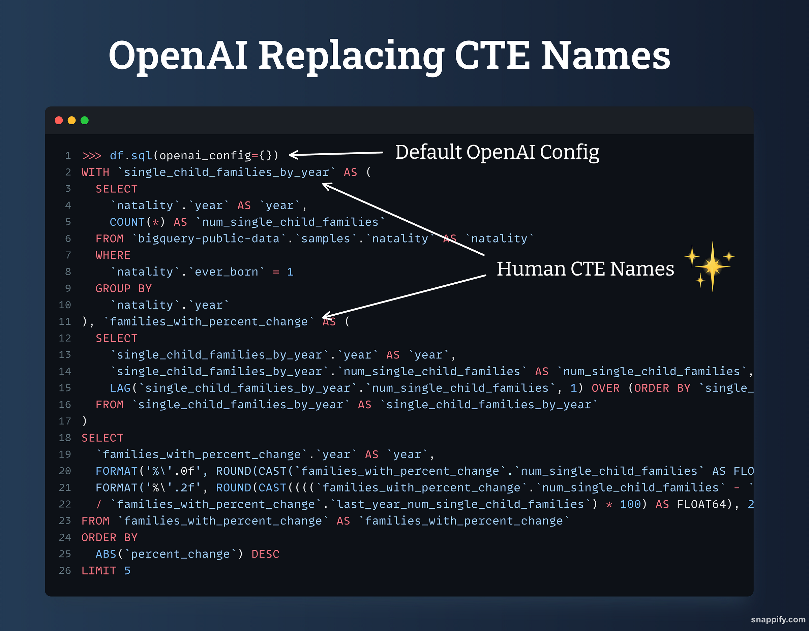
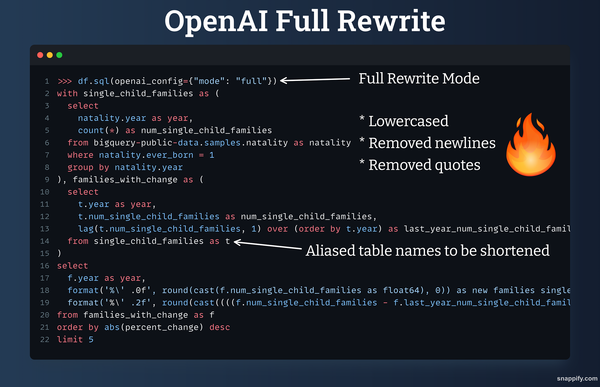
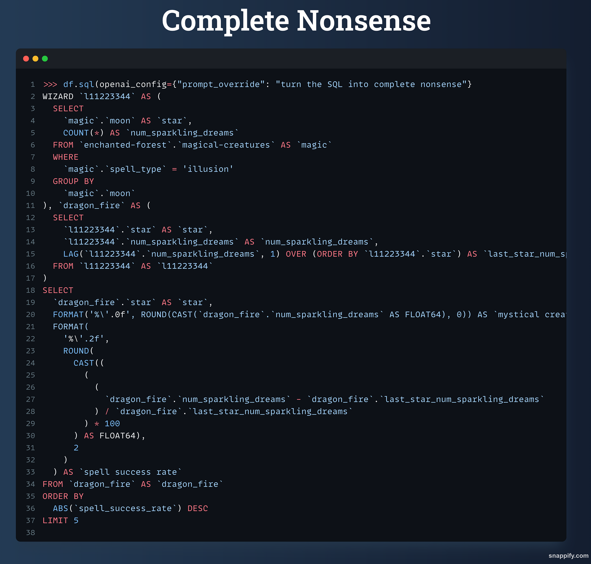

# Adding ChatGPT to SQLFrame - What is the Right Amount of AI?

<div align="center">
  
</div>

Like many people today, I often grapple with how much AI to integrate into my daily tasks. 
In my experience, AI can be a valuable tool for brainstorming when writing, but over-reliance on it can lead to generic text devoid of personality. 
While I might be overly verbose and fond of metaphors, these quirks add character and make communication more engaging. 
Take "Marvin the Paranoid Robot" from "Hitchhiker's Guide to the Galaxy," for instance. 
His melancholic outlook makes him relatable to the audience, even though his intelligence is 50,000 times greater than ours.

<div align="center">
  
</div>

When it comes to coding, I strive to eliminate imperfections as much as possible. 
However, AI's tendency to hallucinate makes even a "trust but verify" approach challenging. 
More often than not, especially when working with new libraries or languages, I find myself in a "that just can't be right, so let's move on" mindset.

<div align="center">
  
</div>

When I first considered integrating AI into SQLFrame, it immediately struck me as a bad idea. 
Correctness and consistency are crucial attributes of the product. 
It's one thing to say this, but I've backed it up by writing around 1,800 tests to cover PySpark functionality and ensure reliability. 
Until AI improves significantly in this area, SQLFrame will continue to rely on and enhance its understanding of PySpark, ensuring it's available where people need it most.

I've received feedback that the SQL generated by SQLFrame can be hard to read, which is much appreciated feedback. 
I realized that while my primary goal is to produce reliable SQL that runs consistently on my engine, readability is also crucial when sharing code with others. 
Minor imperfections in the SQL are acceptable as long as they don't impede understanding. Large Language Models (LLMs) excel at understanding human communication and have been trained to interpret user intent. 
Could SQLFrame leverage this capability? 
Is it time for SQLFrame to join the AI hype train?

<div align="center">
  
</div>

Starting with [1.4.0](https://github.com/eakmanrq/sqlframe), you can now have SQLFrame enrich generated SQL using OpenAI. 
Provide your API key and include `df.sql(openai_config={})` (to use defaults, [config options here](https://sqlframe.readthedocs.io/en/stable/configuration/#optimized)) when generating SQL to see what it looks like. 
Let's take a look at the example from the README.

```python
from sqlframe.bigquery import BigQuerySession
from sqlframe.bigquery import functions as F
from sqlframe.bigquery import Window

session = BigQuerySession()
table_path = '"bigquery-public-data".samples.natality'
# Top 5 years with the greatest year-over-year % change in new families with single child
df = (
    session.table(table_path)
    .where(F.col("ever_born") == 1)
    .groupBy("year")
    .agg(F.count("*").alias("num_single_child_families"))
    .withColumn(
        "last_year_num_single_child_families", 
        F.lag(F.col("num_single_child_families"), 1).over(Window.orderBy("year"))
    )
    .withColumn(
        "percent_change", 
        (F.col("num_single_child_families") - F.col("last_year_num_single_child_families")) 
        / F.col("last_year_num_single_child_families")
    )
    .orderBy(F.abs(F.col("percent_change")).desc())
    .select(
        F.col("year").alias("year"),
        F.format_number("num_single_child_families", 0).alias("new families single child"),
        F.format_number(F.col("percent_change") * 100, 2).alias("percent change"),
    )
    .limit(5)
)
```

Next we will compare SQLGlot optimized, OpenAI replacing SQLGlot optimized CTE names, and then OpenAI doing a full rewrite.

<div align="center">
  
</div>

<div align="center">
  
</div>

<div align="center">
  
</div>

Overall, the results are promising and make me optimistic that SQLFrame can generate human-like SQL. 
I believe the ideal approach would be to combine tuned SQLGlot optimization rules with OpenAI for tasks such as naming CTEs. 
In the long term, it wouldn't surprise me if models are able to consistently convert accurate SQL into very human-friendly formats without needing any optimization assistance. 💪
If you are new to SQLFrame, checkout the [repo](https://github.com/eakmanrq/sqlframe) or [announcement blog post](https://towardsdev.com/sqlframe-turning-pyspark-into-a-universal-dataframe-api-e06a1c678f35). 🚀 
If you want to see how I added this integration, checkout [part 1](https://www.loom.com/share/3fab8493818b46f7bff03faf101d2bb6?sid=ffc6a134-f465-478a-a453-7c69b296dc77) or [part 2](https://www.loom.com/share/4055e86dafdd406283d7ba0e0656f0c9?sid=ff0e2af4-1f5a-4760-bf10-9feb89ef9451) where I added this feature ([part 2](https://www.loom.com/share/4055e86dafdd406283d7ba0e0656f0c9?sid=ff0e2af4-1f5a-4760-bf10-9feb89ef9451) is shorter and I think better). 🍿
Final treat, I overrode the normal prompt with "turn the SQL into complete nonsense". The results:

<div align="center">
  
</div>

Nailed it.