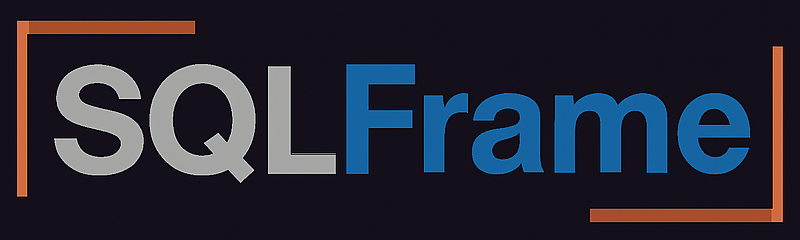

# SQLFrame: Turning PySpark into a Universal DataFrame API
## Have your SQL/Python Cake and Eat it Too

After 13 years as a data engineer, I've grown accustomed to constant change - whether significant shifts like the move to the cloud or smaller trends like the rise of notebooks. 
Amid all this change, one thing has remained constant: SQL. 
Every job I've had, from startups to FAANG, has leveraged the fact that I both understand and write SQL. 
SQL is the universal language that unites all data professionals, and it enables performant pipelines by allowing query planners and optimizers to handle complex details of distributed processing.

Despite its strengths, SQL often seems ill-suited for maintaining data pipelines.
The language lacks support for abstracting common operations or unit testing specific segments of code, leading many to use Jinja as a makeshift solution. 
Jinja SQL is to SQL what Pig Latin is to English - can be fun in small doses but impossible to understand at scale. 
Furthermore, the repetitive nature of SQL, where columns must be specified repeatedly across operations, often leads to fatigue among data professionals. 
This results in data professionals responding to the siren song of `SELECT *`, only to be later found drowning in the sea of non-determinism.

This has put data professionals in a tough spot: Do you write your pipelines in SQL to favor accessibility or Python to favor maintainability? 
Well, starting today, you no longer have to choose. 
You can finally have your cake and eat it too.

<div align="center">
  
</div>

### Introducing open-source SQLFrame!

<div align="center">
  
</div>

[SQLFrame](https://github.com/eakmanrq/sqlframe) revolutionizes how data professionals interact with SQL and PySpark DataFrames. 
Unlike traditional PySpark, SQLFrame converts DataFrame operations directly into SQL, enabling real-time SQL script generation during development. 
Here's how it works:

Consider a scenario where we analyze the number of new families per year choosing to have a single child based on publicly accessible natality data.

```python
from sqlframe.bigquery import BigQuerySession
from sqlframe.bigquery import functions as F
from sqlframe.bigquery import Window

# Unique to SQLFrame: Ability to connect directly to BigQuery
session = BigQuerySession()
table_path = '"bigquery-public-data".samples.natality'
# Get the top 5 years with the greatest year-over-year % change in new families with a single child
df = (
    session.table(table_path)
    .where(F.col("ever_born") == 1)
    .groupBy("year")
    .agg(F.count("*").alias("num_single_child_families"))
    .withColumn("last_year_num_single_child_families", F.lag(F.col("num_single_child_families"), 1).over(Window.orderBy("year")))
    .withColumn("percent_change", (F.col("num_single_child_families") - F.col("last_year_num_single_child_families")) / F.col("last_year_num_single_child_families"))
    .orderBy(F.abs(F.col("percent_change")).desc())
    .select(
        F.col("year").alias("Year"),
        F.format_number("num_single_child_families", 0).alias("number of new families single child"),
        F.format_number(F.col("percent_change") * 100, 2).alias("percent change"),
    )
    .limit(5)
)
# Unique to SQLFrame: Ability to see the SQL for your DataFrame
df.sql()
```

Using SQLFrame, you can utilize the special BigQuery class to seamlessly integrate with your BigQuery environment. 
The DataFrame operations mimic those you'd perform in PySpark, but with SQLFrame, you can also generate and review the corresponding SQL queries in real time using the `df.sql()` method.

```sql
WITH `t94228` AS (
  SELECT
    `natality`.`year` AS `year`,
    COUNT(*) AS `num_single_child_families`
  FROM `bigquery-public-data`.`samples`.`natality` AS `natality`
  WHERE
    `natality`.`ever_born` = 1
  GROUP BY
    `natality`.`year`
), `t39093` AS (
  SELECT
    `t94228`.`year` AS `year`,
    `t94228`.`num_single_child_families` AS `num_single_child_families`,
    LAG(`t94228`.`num_single_child_families`, 1) OVER (ORDER BY `t94228`.`year`) AS `last_year_num_single_child_families`
  FROM `t94228` AS `t94228`
)
SELECT
  `t39093`.`year` AS `year`,
  FORMAT('%\'.0f', ROUND(CAST(`t39093`.`num_single_child_families` AS FLOAT64), 0)) AS `number of new families single child`,
  FORMAT('%\'.2f', ROUND(CAST((((`t39093`.`num_single_child_families` - `t39093`.`last_year_num_single_child_families`) / `t39093`.`last_year_num_single_child_families`) * 100) AS FLOAT64), 2)) AS `percent change`
FROM `t39093` AS `t39093`
ORDER BY
  ABS(`percent_change`) DESC
LIMIT 5
```

This feature not only enhances understanding but also ensures that the SQL output is deterministic, making it suitable for version control. 
That way you can version both the Python and SQL representation of your pipelines and let your co-workers pick which format best suits them!

<div align="center">
  
</div>

SQLFrame though is much more than just generating SQL: the goal is to make the PySpark DataFrame API feel like a native DataFrame API on all major data warehouses. 
Therefore it enables users to execute DataFrame API pipelines directly on their data warehouse without any Spark clusters or libraries!

For instance, replacing `.sql()` with `.show()` in your pipeline displays the results directly from BigQuery, just as it would in PySpark.

```text
>>> df.show()
+------+-------------------------------------+----------------+
| year | number of new families single child | percent change |
+------+-------------------------------------+----------------+
| 1989 |              1,650,246              |     25.02      |
| 1974 |               783,448               |     14.49      |
| 1977 |              1,057,379              |     11.38      |
| 1985 |              1,308,476              |     11.15      |
| 1975 |               868,985               |     10.92      |
+------+-------------------------------------+----------------+
```

Even many of the Catalog operations are supported like `listColumns`:

```text
>>> columns = session.catalog.listColumns(table_path)
>>> print("\n".join([f"Name: {x.name}, Data Type: {x.dataType}, Desc: {x.description}" for x in columns]))
Name: source_year, Data Type: INT64, Desc: Four-digit year of the birth. Example: 1975.
Name: year, Data Type: INT64, Desc: Four-digit year of the birth. Example: 1975.
Name: month, Data Type: INT64, Desc: Month index of the date of birth, where 1=January.
Name: day, Data Type: INT64, Desc: Day of birth, starting from 1.
Name: wday, Data Type: INT64, Desc: Day of the week, where 1 is Sunday and 7 is Saturday.
Name: state, Data Type: STRING, Desc: The two character postal code for the state. Entries after 2004 do not include this value.
```

Therefore not only does SQLFrame make your DataFrame pipeline more accessible, it also turns the PySpark DataFrame API in universal DataFrame API that any data practitioner can enjoy!

<div align="center">
  
</div>

SQLFrame currently supports [BigQuery](https://sqlframe.readthedocs.io/en/stable/bigquery/), [DuckDB](https://sqlframe.readthedocs.io/en/stable/duckdb/), and [Postgres](https://sqlframe.readthedocs.io/en/stable/postgres/), with Redshift, Snowflake, Spark, and Trino in development. 
For those interested in experimenting with SQL generation for other engines, the [StandaloneSession](https://sqlframe.readthedocs.io/en/stable/standalone/) provides a flexible testing ground.

Checkout the [README](https://github.com/eakmanrq/sqlframe) for more information on how to get started with SQLFrame!
